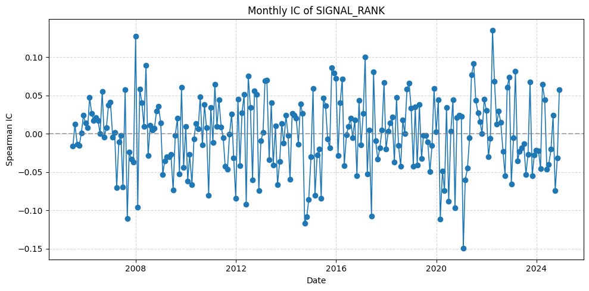
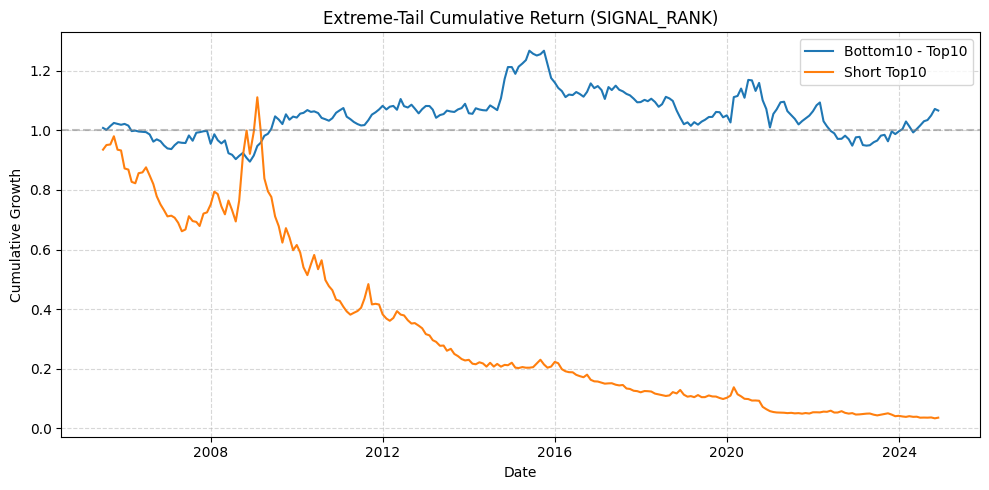
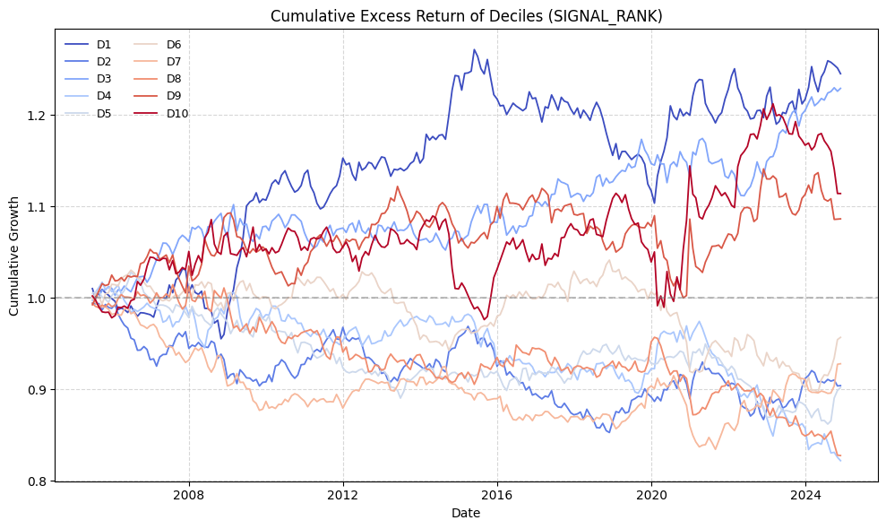

# Cross-Sectional-Alpha-Signal-Research

## Overview

This project evaluates the predictive power and robustness of cross-sectional equity signals using Information Coefficient (IC), Rank IC, and rolling performance analysis.

The research focuses on systematic signal validation, factor persistence, and forward-return predictability under different market environments.

## Research Motivation

Trading activity is often associated with investor attention, disagreement, liquidity shocks, and speculative behavior. This project examines whether abnormal turnover can serve as a useful cross-sectional predictor for future returns.

The research focuses on:

abnormal turnover construction

cross-sectional ranking

predictive signal evaluation

decile portfolio analysis

robustness under different weighting schemes

## Data & Preprocessing
### Data Source

CRSP monthly stock dataset

Common equities only (SHRCD filter)

Sample period: 2005–2024

### Data Cleaning

The preprocessing pipeline includes:

delisting return adjustment

microcap filtering

missing-value handling

cross-sectional ranking

size neutralization

excess return construction

These steps were implemented to reduce distortions commonly encountered in empirical asset-pricing research.

## Signal Construction

The signal measures abnormal trading activity relative to historical turnover behavior.

### Core Steps
1.Calculate stock turnover

2.Construct rolling abnormal-turnover measure

3.Apply cross-sectional ranking

4.Neutralize size effects

5Evaluate predictive relationship with next-period returns

## Methodology
### Signal Evaluation

The project evaluates predictive power using:

Spearman Information Coefficient (IC)

Rank IC

Monthly IC stability analysis

Negative IC frequency

## Portfolio Construction

Decile portfolios were constructed using both:

Equal-weighted returns

Value-weighted returns

Additional tests include:

long-short extreme-tail portfolios

cumulative excess return analysis

market-neutral evaluation

## IC Summary Results

| Metric | Value |
|:---|---:|
| Mean IC | -0.0006 |
| IC Std | 0.0484 |
| t-stat | -0.20 |
| Negative IC Ratio | 48.5% |
| Number of Months | 234 |

## Key Findings
The abnormal-turnover signal showed weak overall predictive power during the sample period.

Average IC was close to zero and statistically insignificant, suggesting limited cross-sectional forecasting ability.

Monthly IC values fluctuated substantially across time, indicating unstable signal performance under changing market conditions.

Decile portfolio spreads were modest and lacked persistent monotonic structure across the full sample.

Extreme-tail portfolios exhibited periods of temporary divergence, but long-run excess performance remained economically limited.

Results highlight the importance of robustness testing and realistic evaluation when studying cross-sectional trading signals.

## Visualization
### Monthly Rank IC

The monthly Rank IC series fluctuates around zero with significant variation across periods, indicating unstable predictive relationships between abnormal turnover and future returns.

### Extreme-Tail Portfolio Performance

Extreme-tail portfolios showed temporary periods of divergence; however, cumulative performance differences were not consistently sustained over time.

### Decile Portfolio Cumulative Excess Returns

Decile portfolio results did not display strong monotonic ordering, suggesting limited signal strength after cross-sectional ranking and neutralization adjustments.

